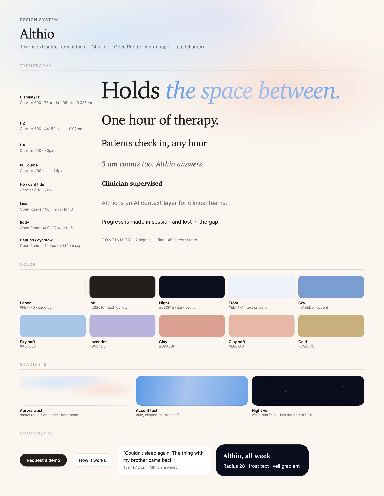
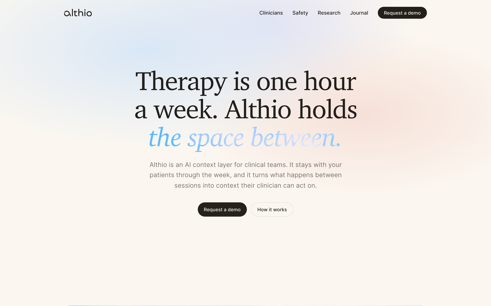

# Althio Design System

The design system of [althio.ai](https://althio.ai), documented for reuse across applications.
Tokens were extracted from the live site on 2026-08-16. Values the site does not expose
(icon rules, some state styles) are filled in to match the system and marked **Inferred**.
Everything else is **Extracted**.



## Contents

1. [Design principles](#1-design-principles)
2. [Foundations](#2-foundations) — color, typography, spacing, layout, shape, gradients, motion, accessibility
3. [Components](#3-components)
4. [Patterns](#4-patterns)
5. [Content and voice](#5-content-and-voice)
6. [Token reference](#6-token-reference)

Files: `tokens.css` (all tokens as CSS custom properties), `specimen/specimen.html`
(source of the image above), `assets/` (renders and site screenshots).

---

## 1. Design principles

- **Editorial and calm.** Big serif statements carry the message. Small sans-serif UI stays quiet.
- **Warm by day, cool by night.** Light sections use warm paper and warm ink. The dark section uses cool navy and frost. One page holds both.
- **Color is scarce.** Pastels decorate. Ink speaks. Accent colors never carry text.
- **Soft, never sharp.** Every corner is round. Buttons are pills. Depth comes from translucency and glow, not drop shadows.
- **The system serves continuity of care.** The visual language is quiet on purpose: it must feel safe at 3 am and professional at 9 am.

---

## 2. Foundations

### 2.1 Brand

**Extracted.** The wordmark is `althio` in lowercase Open Runde, set in Ink on light
surfaces. It sits top-left in navigation. Do not set the wordmark in Charter, in
uppercase, or in an accent color.

### 2.2 Color

Two layers: **primitives** (raw values) and **semantic roles** (what code should use).

#### Primitives — neutrals (Extracted)

| Token | Hex | Note |
|---|---|---|
| `--color-paper` | `#FBF7F0` | Warm off-white. The base of every light section. |
| `--color-ink` | `#23201C` | Warm near-black. Never pure black. |
| `--color-night` | `#0B0F1E` | Cool navy-black. Dark-section background. |
| `--color-frost` | `#EDF1FA` | Cool off-white. Never pure white for text. |
| `--color-white` | `#FFFFFF` | Card surfaces, usually at 72% opacity. |

#### Primitives — pastel accents (Extracted)

| Token | Hex | Token | Hex |
|---|---|---|---|
| `--color-sky` | `#7A9ED0` | `--color-lavender` | `#B9B4DE` |
| `--color-sky-mid` | `#8FADD6` | `--color-lavender-mid` | `#ADA5DC` |
| `--color-sky-soft` | `#A8C6E8` | `--color-clay` | `#D9A08F` |
| `--color-gold` | `#C9AF7C` | `--color-clay-soft` | `#E8B7A6` |

#### Semantic roles (use these in code)

| Role | Value | Use |
|---|---|---|
| `--text-primary` | Ink | Body copy, headings, buttons. |
| `--text-secondary` | Ink 60% | Subcopy, captions, large secondary text. |
| `--text-muted` | Ink 34% | Decorative labels only. |
| `--text-on-dark` | Frost | All text on Night surfaces. |
| `--surface-page` | Paper | Page background. |
| `--surface-card` | White 72% | Cards and panels on paper. |
| `--surface-dark` | Night | The dark section. |
| `--border-hairline` | Ink 8% | Card borders, dividers. |
| `--border-strong` | Ink 15% | Secondary-button borders. |

Rules:

- Text is Ink on Paper, or Frost on Night. There are no other text colors.
- Build hierarchy with the opacity steps of Ink (60%, 34%). Do not add gray hexes.
- Accents appear as chips, avatars, and data marks. They never carry text and never fill large surfaces.
- Warm and cool never mix in one surface: Paper pairs with Ink and Clay; Night pairs with Frost and Sky.

### 2.3 Typography

#### Typefaces (Extracted)

| Role | Family | Source |
|---|---|---|
| Headings, pull quotes | **Charter** (system serif) | `Charter, "Iowan Old Style", Georgia, "Times New Roman", serif`. No webfont. |
| Body, UI, captions | **Open Runde** | [lauridskern/open-runde](https://github.com/lauridskern/open-runde) v1.0.1 via jsDelivr. Weights 400/500/600/700. |

- Set all headings in Charter 500. Use Charter 600 only for small card titles.
- Set all UI text, body text, buttons, and captions in Open Runde.
- Use Charter italic for pull quotes and for one gradient accent phrase in a headline.
- Do not use Charter for buttons or navigation. Do not use Open Runde for headings.

#### Type scale — desktop 1440 (Extracted)

| Token | Family / weight | Size | Line height | Letter spacing | Use |
|---|---|---|---|---|---|
| `--text-display` | Charter 500 | 78px | 1.06 | −0.025em | Hero headline |
| `--text-h2` | Charter 500 | 52px | 1.12 | −0.02em | Section headline |
| `--text-h2-alt` | Charter 500 | 44px | 1.15 | −0.02em | Secondary section headline |
| `--text-h3` | Charter 500 | 40px | 1.15 | −0.02em | Sub-section headline |
| `--text-h4` | Charter 500 | 30px | 1.2 | −0.015em | Card headline |
| `--text-pull` | Charter 400 italic | 24px | 1.4 | 0 | Editorial aside |
| `--text-h5` | Charter 600 | 21px | 1.6 | −0.01em | Small card title |
| `--text-lead` | Open Runde 400 | 19px | 1.6 | 0 | Hero subcopy |
| `--text-body` | Open Runde 400 | 17px | 1.6 | 0 | Paragraphs, lists |
| `--text-body-sm` | Open Runde 400 | 16px | 1.6 | 0 | Dense copy |
| `--text-ui` | Open Runde 500 | 15px | 1.5 | 0 | Navigation links |
| `--text-button` | Open Runde 500 | 14px | 1.6 | 0 | All buttons |
| `--text-caption` | Open Runde 400 | 12.5px | 1.6 | 0 | Metadata lines |
| `--text-eyebrow` | Open Runde 500 | 12.5px | 1.6 | +0.14em, caps | Section labels |
| `--text-micro` | Open Runde 400 | 12px | 1.6 | 0 | Timestamps |

Headline tracking is negative and scales with size: −2.5% of the font size at 78px,
−2% at 40–52px. Body text never goes below 15px; captions never below 12px.

**Inferred — smaller viewports:** the site scales all sizes by the viewport
(Framer scaling). For fixed layouts, step the display down to ~56px on tablet
(810–1199px) and ~40px on phone (<810px); keep body at 16–17px everywhere.

### 2.4 Spacing (Extracted values, scale formalized)

A 4px base scale. Site measurements cluster on these steps (normalized to the 1440 design size):

| Token | Value | Observed use |
|---|---|---|
| `--space-2` | 8px | Chip gaps, icon-to-label |
| `--space-3` | 12px | Grid gutters, list gaps |
| `--space-4` | 16px | Component-internal padding |
| `--space-6` | 24px | Card padding, related-block gaps |
| `--space-7` | 28px | Large card padding |
| `--space-8` | 32px | Sub-section gaps |
| `--space-14` | 56px | Section-internal group gaps |
| `--space-16` | 64px | Large group separations |
| `--space-24`–`--space-32` | 96–128px | Section padding (see layout) |

Rule: related items sit closer than unrelated items. Never use an off-scale value
when a scale step is within 2px.

### 2.5 Layout and grid (Extracted)

| Token | Value | Use |
|---|---|---|
| `--container-max` | 1120px | Main content column, centered |
| `--prose-max` | 760px | Long-form text measure (~66 characters) |
| `--section-pad-y` | 130px | Vertical padding between major sections (site range 96–170px) |

- One centered column. No multi-column dashboard grids on marketing surfaces.
- Card rows use 2–3 equal columns with 12px gutters inside the container.
- **Inferred — breakpoints** (Framer defaults): desktop ≥1200px, tablet 810–1199px, phone <810px.

### 2.6 Shape and depth (Extracted)

| Token | Value | Use |
|---|---|---|
| `--radius-pill` | 999px | Buttons, chips |
| `--radius-card` | 28px | Large cards and panels |
| `--radius-panel` | 18px | Inner panels; chat bubble: `18px 18px 18px 5px` (tail corner) |
| `--radius-tile` | 14px | Small tiles |
| `--shadow-frost-glow` | `rgba(237,241,250,0.45) 0 0 8px` | Glow on dark-section elements |
| `--shadow-focus-ring` | `rgba(122,158,208,0.38) 0 0 0 1.25px` | Sky-tinted ring |
| `--shadow-halo` | white 14% ring + white 65% glow | Emphasis halo on light surfaces |

Radius follows hierarchy: the bigger the element, the bigger the radius. Never one
uniform radius on everything. Depth comes from translucent white surfaces
(`--surface-card`) with hairline borders — not from drop shadows.

### 2.7 Gradients and texture (Extracted)

| Token | Definition | Use |
|---|---|---|
| `--gradient-aurora` | 3 pastel radials (`#D9E7F6`, `#F6E0D8`, `#E5E3F2`) on Paper | Hero background only. Confine to the hero band; never tile it down the page. |
| `--gradient-accent-text` | `linear-gradient(100deg, #5B9BE6, #A9C4EE 45%, #6FA5E8)`, clipped to text | One italic phrase per hero headline. The live site clips a soft blue image; this approximates it. |
| `--gradient-night-veil` | `rgba(8,10,22)` 55% → 18% → 58% vertical | Depth overlay on the dark section. |
| `--gradient-hairline` | transparent → `rgba(237,241,250,0.35)` → transparent | Dividers on dark surfaces that fade at both ends. |
| Starfield | 1–1.5px white radial dots, scattered, 50–85% opacity | Decorative texture in the night section only. |

### 2.8 Motion (Extracted)

| Token | Value | Use |
|---|---|---|
| `--ease-gentle` | `cubic-bezier(0.22, 0.9, 0.3, 1)` | The signature curve: all movement and reveals |
| `--duration-fast` | 200ms | Color and opacity changes (hover) |
| `--duration-base` | 250ms | Border-color, small shifts |
| `--duration-slow` | 350ms | Transform: slides, reveals, scroll-ins |

- Animate only `transform`, `opacity`, `color`, and `border-color`. Never animate layout properties.
- Name transition properties explicitly. Do not use `transition: all`.
- **Inferred:** honor `prefers-reduced-motion: reduce` by removing transforms and keeping opacity fades.

### 2.9 Iconography and imagery (Inferred)

The site uses almost no icons; text and typography carry meaning.

- If an icon is required: simple geometric line icons, 1.5px stroke, set in `--text-secondary`, 16–20px, never in colored circles.
- Decorative texture is limited to the aurora wash and the starfield. No stock photography, no illustration sets, no emoji as design elements.
- Product imagery appears as framed UI mockups inside `--surface-card` panels.

### 2.10 Accessibility

Contrast pairs on this palette (computed):

| Pair | Ratio | Verdict |
|---|---|---|
| Ink on Paper | 14.9:1 | Body text: pass AAA |
| Frost on Night | 15.9:1 | Body text on dark: pass AAA |
| Ink 60% on Paper | ≈4.2:1 | Large/secondary text only. **Do not use for body copy.** |
| Ink 34% on Paper | ≈2.1:1 | Decorative only. Never for information. |
| Paper on Ink (buttons) | 14.9:1 | Pass |
| Any accent as text | 2–4:1 | **Fails. Accents never carry text.** |

Rules (Inferred, standard practice):

- Touch targets: 44px minimum. The pill button (14px text + 12px vertical padding) meets it.
- Focus: every interactive element shows `--shadow-focus-ring`. Never remove outline without a replacement.
- The accent-text gradient is decoration on top of a serif that is already legible; do not put critical information only in the gradient phrase.
- Do not encode meaning in color alone; pair accent chips with labels.

---

## 3. Components

### 3.1 Primary button

- Ink background, Paper text, `--radius-pill`, `--text-button`, padding ~12px 22px.
- Hover: opacity/color shift at `--duration-fast`. Focus: `--shadow-focus-ring`.
- **When to use:** the one primary action per view ("Request a demo"). One per section.
- **Don't:** never two primary buttons side by side; never accent-colored buttons.

### 3.2 Secondary button

- `--surface-card` background, Ink text, `--border-strong` border, same pill geometry.
- **When to use:** the alternative action next to a primary ("How it works").

### 3.3 Card

- `--surface-card`, `--radius-card`, `--border-hairline`, padding `--space-6`–`--space-7`.
- Title in Charter (`--text-h5` or `--text-h4`), body in Open Runde.
- **Don't:** no drop shadows, no colored left borders, no icon-in-circle headers.

### 3.4 Chat bubble

- White, `--radius-panel` with one 5px tail corner, `--text-ui` body, `--text-micro` timestamp in `--text-secondary` below.

### 3.5 Eyebrow label

- `--text-eyebrow`: 12.5px Open Runde 500, uppercase, +0.14em tracking, `--text-secondary`.
- Sits above section headlines. **Don't** use it as body emphasis.

### 3.6 Navigation

- Wordmark left; links in `--text-ui`; primary button right as a pill.
- Links: Ink, hover shifts color at `--duration-fast`. No underlines at rest.

### 3.7 Night section

- `--surface-dark` + `--gradient-night-veil` + starfield. Text in Frost; dividers use `--gradient-hairline`; glows use `--shadow-frost-glow`.
- **When to use:** one emotional "always on" section per page. Never stack two.

---

## 4. Patterns

**Page anatomy (Extracted from althio.ai):** aurora hero → editorial claim sections
(alternating text and framed mockups) → night section (the 3 am moment) → light
close with primary CTA → footer.

- Each section makes one claim: one headline, one supporting sentence, one visual.
- The dark section is the emotional pivot; place it after the rational argument.
- Hero budget: wordmark, one headline (with one gradient phrase), one lead paragraph, two buttons.
- Serif carries claims; sans carries evidence (captions, metadata, UI text).

---

## 5. Content and voice

**Extracted from site copy:**

- Short declarative sentences. "Therapy is one hour a week. Althio holds the space between."
- Numbers are concrete: "One hour of therapy. 167 hours of life." "2 signals · 1 flag · 40-second read."
- Time is human: "Tue 11:42 pm", "3 am counts too."
- Interpuncts (`·`) join metadata fragments; the arrow (`→`) marks inline links: "Read how we build for safety →".
- Curly quotes, true ellipsis (`…`), no exclamation marks, no hype adjectives.
- Safety statements are plain and unhedged: "Althio never diagnoses or changes a treatment plan."

---

## 6. Token reference

All tokens live in [`tokens.css`](tokens.css). Import it first, then use semantic
aliases in application code:

```html
<link rel="stylesheet" href="tokens.css">
<style>
  body {
    font-family: var(--font-sans);
    color: var(--text-primary);
    background-color: var(--surface-page);
  }
  h1 {
    font-family: var(--font-serif);
    font-weight: 500;
    font-size: var(--text-display);
    letter-spacing: -0.025em;
    line-height: 1.06;
  }
  .cta {
    background: var(--color-ink);
    color: var(--color-paper);
    border-radius: var(--radius-pill);
    transition: opacity var(--duration-fast) ease;
  }
</style>
```

Naming convention: primitives are `--color-*`, `--text-*` (scale), `--space-*`,
`--radius-*`, `--shadow-*`, `--gradient-*`, `--duration-*`, `--ease-*`. Semantic
aliases (`--text-primary`, `--surface-card`, `--border-hairline`) map primitives to
roles; application code uses the aliases so a palette change stays one-file.

Reference screenshot of the live site:


